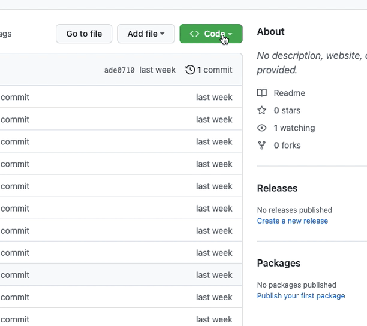
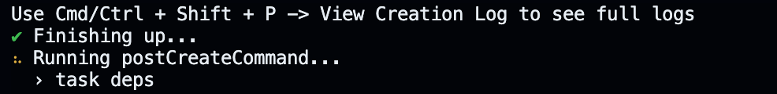
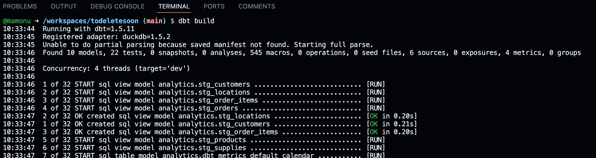
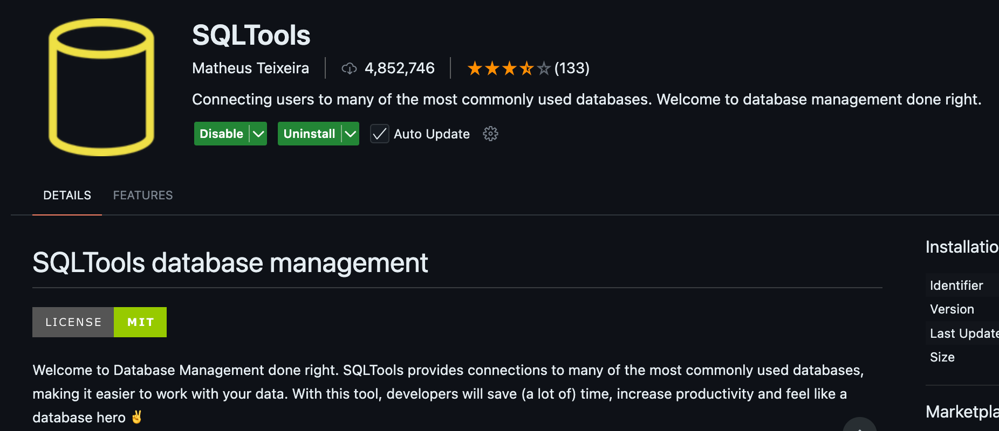
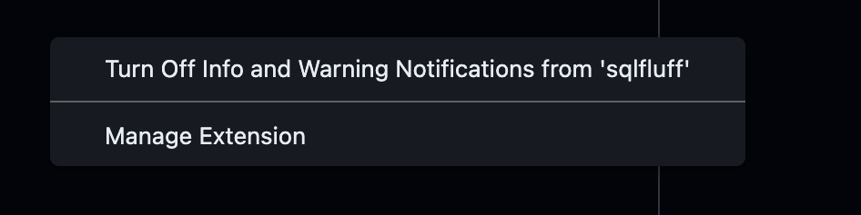

# 🚀 DBT Sandbox Environment in GitHub Codespaces Template

<br/><br/>

Welcome to the **DBT Sandbox Environment**! This GitHub Codespace template lets you (and anyone else) spin up a fully-functional **dbt development environment** with just a few clicks. 

✨ Once set up, you'll have:
- A complete dbt environment ready to go.
- A connection to a DuckDB database.
- One year of data from the fictional **Jaffle Shop café** to work with.

---


### Step 1: **Create Your Repository**

<br/><br/>

Click the big green **'Use this template'** button, then select **'Create a new repository'**.


⚠️ **Note**: Make sure to create the repository in your personal GitHub space and **not** under `moj-analytical-services` or any other organization.

---

### Step 2: **Launch Your Codespace**

<br/><br/>

Navigate to **'Code'**, select **'Codespaces'**, and click **'Create codespace on main'**.



This will set up a sandboxed development container with everything pre-configured for your dbt project.

<br/><br/>

---

### Step 3: **Patience Is Key**

<br/><br/>

Setting up the codespace takes about **4 minutes**. 🕒 





Perfect time to brew yourself a nice cup of tea ☕️.

<br/><br/>

---

### Step 4: **Run Your First dbt Command**


<br/><br/>


Once the setup is complete, navigate to the terminal in your Codespace environment and run:

```bash
dbt build
```

You should see something like :




---


### Step 5: **Install a DuckDB connector extension **

<br/><br/>

To view and query your dbt transformation results directly in your Codespace, you'll need to install a DuckDB-compatible extension. 

We recommend installing the **SQLTools** extension in VS Code for this purpose, togother with the **DuckDB driver for SQLTools**




<br/><br/>


---

<br/><br/>

💡 **SQLTools Configuration Tips**: 

- Once installed, configure SQLTools to connect to your DuckDB database, 
which exists in `/reports/jaffle_shop.duckdb`and you'll be able to explore your transformed data with ease!

- when asked about the location of your DB when creating the connection just put
`/workspaces/{NAME_OF_YOUR_REPO}/reports/jaffle_shop.duckdb` taking care to change {NAME_OF_YOUR_REPO} to the name of your repo !

- you might be asked to install a few bits the first time ... Just install them. 

- sqlfluff can be uninstalled or muted as it constantly spamming messages that are not at the moment important.
  


- Also remember that when connected for the first time to the DuckDB database to run `SET SCHEMA 'analytics';` so you
  can see the result of your dbt transformations

<br/><br/>

---


<br/><br/>

### Step 6:  🛠 What to do after installing the codespace in your repo and setting everything up:

<br/><br/>


Once your Codespace is up and running, it’s time to dive into the project files and make some changes. 
Start by exploring the following:

- **`/models/marts/__models.yml`**
- **`/models/marts/orders_with_random_number.sql`**

🔍 **What to Do:**
1. Open `orders_with_random_number.sql` and make some modifications.
2. Save your changes.
3. Run the following command to rebuild your models and see the results:

```bash
dbt build
```
<br/><br/>


---


### Step 7: Sandbox Environment: Your Learning Playground 🌱

<br/><br/>

Now that you're familiar with the development feedback loop, you have a powerful sandbox environment at your fingertips. 
This space is designed for experimentation and learning, allowing you to dive deep into all the intricacies of dbt. 
Whether it's refining models, testing transformations you can use this opportunity to master dbt workflows in a safe and controlled environment

<br/><br/>


### Step 8: 🛠 **Persist Your Changes Using Git**

<br/><br/>

Once you've made updates and tested your transformations, it's important to save and persist your changes to your repository. 
Use the following Git commands:

1. Check the status of your changes:

```bash
git status
```

2. Stage all your changes:

```bash
git add .
```

3. Commit your updates with a descriptive message:

```bash
git commit -m "Describe your changes here"
```

4. Push your changes to the `main` branch:

```bash
git push origin main
```

